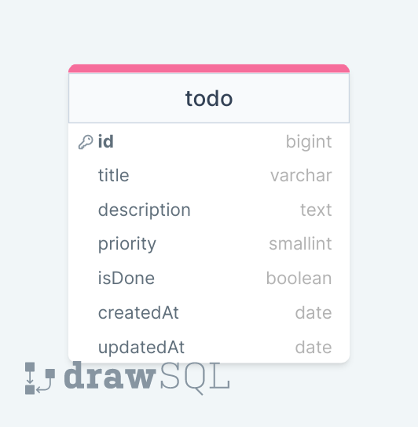

# EXPRESSJS ToDo Project with Sequelize

### ERD:



### Folder/File Structure:

```
    .env
    .gitignore
    app.js
    readme.md
        app----
           ---errorHandler.js
               ---dbConnection.js
           ---models
               ---todoModel.js
           ---controllers
               ---todoController.js
           ---routes
               ---todoRoute.js
```
